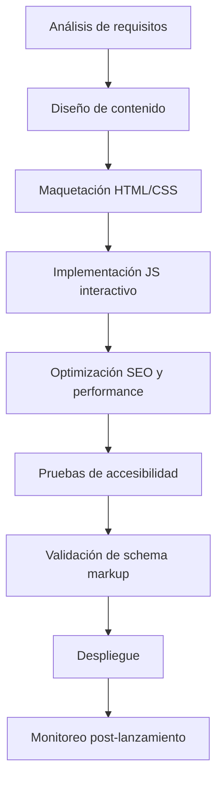

# Especificación de Página de Aterrizaje para Psicóloga - Florencia Daiana Lazo

## 1. Visión General del Proyecto

**Objetivo:** Crear una página de aterrizaje profesional, accesible y optimizada para la psicóloga **Florencia Daiana Lazo**, que transmita confianza, profesionalismo y empatía, con el fin de atraer nuevos clientes y facilitar el contacto.

**Psicóloga:**
- **Nombre completo:** Florencia Daiana Lazo
- **Especialidad:** Psicoanálisis – Adolescentes, Jóvenes y Adultos
- **Ubicación:** San Miguel de Tucumán, Barrio Sur (Tucumán, Argentina)
- **Contacto primario:** WhatsApp +54 9 381 355‑8184
- **Red social:** Instagram @psico.tuc
- **Paleta de colores:** Tonos claros de marrón (brown pallets) – colores relajantes

**Idioma:** Español (Argentina)

**Público objetivo:** Adolescentes, jóvenes y adultos residentes en Tucumán y alrededores que buscan terapia psicológica individual, con enfoque psicoanalítico.

## 2. Requisitos de Contenido

Basado en las reglas de contenido (`content.md`) y la habilidad `psychology‑landing‑page`.

### 2.1. Estructura de la Página

| Sección | Contenido obligatorio | Notas |
|---------|----------------------|-------|
| **Header / Hero** | Nombre completo, credenciales (ej. “Lic. Florencia Daiana Lazo – Psicóloga - M.P. 4079”), frase de valor (“Acompañándote en tu bienestar emocional”), botón principal (“Reserva una consulta gratuita”). | Imagen de fondo calmada (oficina, naturaleza abstracta). |
| **Sobre la Psicóloga** | Biografía breve que destaque formación, licencias, experiencia, enfoque (psicoanálisis). Foto profesional (sonriente, cercana). | Incluir elementos que generen confianza (años de ejercicio, membresías). |
| **Servicios** | Lista de servicios: terapia individual para adolescentes, jóvenes y adultos. Especialidades: ansiedad, depresión, trastornos de la personalidad, orientación vocacional, etc. | Cada servicio con icono y descripción concisa. |
| **Modalidad de Atención** | Presencial (consultorio en Barrio Sur) y remota (videollamada). Para sesiones remotas, el pago debe realizarse minutos antes de iniciar la sesión. | Informar claramente las opciones y el procedimiento de pago. |
| **¿Por qué elegirme?** | Señales de confianza: membresías (Colegio de Psicólogos de Tucumán), testimonios de clientes (iniciales y foto si hay consentimiento), estadísticas (ej. “+100 pacientes acompañados”). | Los testimonios deben ser reales y con lenguaje empático. |
| **Cómo funciona** | Pasos claros: 1. Contacto inicial (WhatsApp/email), 2. Entrevistas Preliminares, 3. Plan personalizado, 4. Seguimiento continuo. | Incluir respuestas a preocupaciones comunes (costo, frecuencia, confidencialidad). |
| **Contacto y Ubicación** | Formulario de contacto (nombre, email, mensaje), teléfono, email, dirección física (Barrio Sur), mapa embebido (Google Maps), horarios de atención, botones de contacto directo (WhatsApp, Gmail, Instagram). | El formulario debe ser simple y cumplir con normativas de privacidad. Los botones deben enlazar a las respectivas aplicaciones. |
| **Preguntas Frecuentes (FAQ)** | Preguntas típicas: “¿Cuánto cuesta una sesión?”, “¿Atiendes obras sociales?”, “¿Qué es el psicoanálisis?”, “¿Cómo sé si necesito terapia?”. | Respuestas claras y tranquilizadoras; especificar que no se trabaja con obras sociales. Usar acordeón nativo (`<details>`). |
| **Footer** | Repetir datos de contacto, enlaces a política de privacidad, términos de servicio, iconos de redes (Instagram, WhatsApp), aviso de copyright. | Asegurar que el footer sea accesible y ordenado. |

### 2.2. Tono y Voz
- **Profesional pero cercano:** Evitar lenguaje técnico excesivo; explicar conceptos psicológicos en lenguaje cotidiano.
- **Empático:** Reconocer las dificultades del visitante sin sonar paternalista.
- **Confidencialidad:** Enfatizar que las sesiones son privadas y seguras.
- **Llamados a la acción (CTA)** con lenguaje activo: “Comienza tu proceso hoy”, “Contáctame”, “Agenda tu primera sesión”.

## 3. Directrices de Diseño y Visuales

### 3.1. Paleta de Colores
- **Colores principales:** Tonos claros de marrón (brown pallets) – ej. `#D7CCC8`, `#BCAAA4`, `#A1887F`.
- **Colores de acento:** Complementarios relajantes (verdes suaves, azules claros) – ej. `#81C784`, `#4FC3F7`.
- **Contraste:** Cumplir relación 4.5:1 para texto normal (WCAG AA).

### 3.2. Tipografía
- **Fuente principal:** Sans‑serif legible (Open Sans, Roboto, Lato) cargada via Google Fonts.
- **Tamaños en `rem`:** Cuerpo de texto `1rem` (16px), escalado proporcional para headings.
- **Interlineado:** `line‑height` mínimo 1.5.

### 3.3. Imágenes
- **Calidad alta, optimizadas:** Formato WebP con fallback JPEG, compresión sin pérdida visible.
- **Temas:** Fotografías auténticas de la psicóloga (en consultorio), imágenes abstractas calmadas (naturaleza, texturas suaves).
- **Evitar clichés:** No usar fotos de stock excesivamente genéricas.
- **Atributos `alt` descriptivos** para todas las imágenes informativas.

### 3.4. Espaciado y Layout
- **Enfoque mobile‑first:** Diseño responsive que funcione desde 320px hasta 1920px.
- **Grid CSS / Flexbox** para alineación consistente.
- **White‑space generoso** para reducir carga cognitiva.

## 4. Requisitos Técnicos

Integración de las habilidades definidas en `.kilocode/skills‑code/`.

### 4.1. Diseño Web Responsive (`responsive‑web‑design`)
- Breakpoints basados en contenido:
  ```css
  /* Base (mobile) */
  /* Tablet */
  @media (min‑width: 768px) { … }
  /* Desktop */
  @media (min‑width: 1024px) { … }
  /* Pantallas grandes */
  @media (min‑width: 1280px) { … }
  ```
- Touch targets mínimos de 44×44 px.
- Imágenes fluidas (`max‑width: 100%`).

### 4.2. Accesibilidad Web (`web‑accessibility`)
- Cumplimiento WCAG 2.1 Nivel AA.
- HTML semántico (`<header>`, `<nav>`, `<main>`, `<section>`, etc.).
- Jerarquía de encabezados correcta (`h1` único, sin saltos).
- Navegación completa con teclado (`Tab`, `Enter`).
- Indicadores de foco visibles.
- Enlace “saltar al contenido” como primer elemento enfocable.
- Atributos ARIA solo cuando sea necesario.
- Texto de alto contraste (≥4.5:1).
- Etiquetas `<label>` para todos los campos del formulario.

### 4.3. Optimización de Rendimiento (`performance‑optimization`)
- **Métricas Core Web Vitals:**
  - LCP ≤ 2.5 s
  - FID ≤ 100 ms
  - CLS ≤ 0.1
- **Imágenes:** WebP/AVIF con `srcset` y `sizes`, `loading="lazy"`, dimensiones explícitas (`width`/`height`).
- **CSS/JS:** Minificado, concatenado (cuando convenga), critical CSS inlined, scripts no críticos con `defer`.
- **Fuentes:** Subset, `font‑display: swap`, preload de fuentes críticas.
- **Caché:** Headers `Cache‑Control` apropiados, service worker opcional.
- **Servidor:** CDN, compresión (Brotli/gzip), TTFB < 600 ms.

### 4.4. SEO (`seo‑optimization`)
- **Meta tags:**
  - `<title>`: “Florencia Daiana Lazo | Psicóloga Psicoanalítica | Tucumán”
  - `<meta name="description">` (150‑160 caracteres) con keywords relevantes.
  - Open Graph y Twitter Card para compartir en redes.
- **Estructura de datos (Schema.org):** JSON‑LD para `LocalBusiness` + `Psychologist` + `MedicalBusiness` (detallado en sección 4.5).
- **Technical SEO:** `robots.txt`, `sitemap.xml`, canonical tags, URLs limpias.
- **On‑page SEO:** Keywords naturales en headings y cuerpo, `alt` en imágenes, enlaces internos/externos.
- **Mobile‑friendly:** Pasar Google's Mobile‑Friendly Test.

### 4.5. Schema Markup (`schema‑markup`)
Implementar JSON‑LD con los siguientes fragmentos (adaptados a Argentina):

```json
<script type="application/ld+json">
{
  "@context": "https://schema.org",
  "@graph": [
    {
      "@type": "Psychologist",
      "@id": "https://psico‑tuc.com/#psychologist",
      "name": "Florencia Daiana Lazo",
      "description": "Psicóloga psicoanalítica especializada en adolescentes, jóvenes y adultos en Tucumán.",
      "image": "https://psico‑tuc.com/images/foto‑perfil.jpg",
      "url": "https://psico‑tuc.com/",
      "telephone": "+5493813558184",
      "email": "contacto@psico‑tuc.com",
      "address": {
        "@type": "PostalAddress",
        "streetAddress": "Barrio Sur",
        "addressLocality": "San Miguel de Tucumán",
        "addressRegion": "Tucumán",
        "postalCode": "T4000",
        "addressCountry": "AR"
      },
      "openingHoursSpecification": [
        {
          "@type": "OpeningHoursSpecification",
          "dayOfWeek": ["Monday", "Tuesday", "Wednesday", "Thursday", "Friday"],
          "opens": "09:00",
          "closes": "18:00"
        }
      ],
      "priceRange": "$$",
      "medicalSpecialty": ["Psychoanalysis", "ClinicalPsychology"],
      "knowsAbout": ["Psicoanálisis", "Terapia para adolescentes", "Orientación vocacional"],
      "sameAs": [
        "https://www.instagram.com/psico.tuc/",
        "https://api.whatsapp.com/send?phone=5493813558184"
      ]
    },
    {
      "@type": "ProfessionalService",
      "name": "Servicios de Terapia Psicológica",
      "description": "Terapia individual para adolescentes, jóvenes y adultos con enfoque psicoanalítico.",
      "provider": { "@id": "https://psico‑tuc.com/#psychologist" },
      "hasOfferCatalog": {
        "@type": "OfferCatalog",
        "name": "Servicios",
        "itemListElement": [
          {
            "@type": "Offer",
            "name": "Terapia para Adolescentes",
            "description": "Acompañamiento psicológico especializado en la etapa adolescente."
          },
          {
            "@type": "Offer",
            "name": "Terapia para Adultos",
            "description": "Proceso terapéutico individual para adultos."
          }
        ]
      }
    }
  ]
}
</script>
```

### 4.6. Interactividad JavaScript (`javascript‑interactivity`)
- **Scroll suave** para enlaces internos (`scrollIntoView({behavior:'smooth'})`).
- **Validación de formulario** en el cliente (email válido, campos requeridos) con mensajes de error accesibles.
- **Modal/Lightbox** para detalles de servicios (accesible con teclado, cierre con `Esc`).
- **Acordeón nativo** (`<details>`) para FAQ; si se necesita estilo personalizado, asegurar ARIA.
- **Navegación sticky** que se fija al hacer scroll, con actualización del enlace activo.
- **Botón “volver arriba”** que aparece después de cierto desplazamiento.
- **Carga diferida de imágenes** (`loading="lazy"`).
- **Mejora progresiva:** Todas las funcionalidades deben funcionar sin JavaScript (formulario con `action`/`method` fallback).

## 5. Estructura de Archivos y Estilo de Código

### 5.1. Organización de Directorios
```
/
├── index.html
├── css/
│   ├── main.css
│   └── critical.css (opcional, inline)
├── js/
│   ├── main.js
│   └── modules/ (si se necesitan)
├── images/
│   ├── hero‑background.webp
│   ├── hero‑background.jpg
│   ├── foto‑perfil.webp
│   └── icons/
├── plans/ (documentación)
├── robots.txt
└── sitemap.xml
```

### 5.2. Reglas de Estilo de Código (`code‑style.md`)
- **HTML:** Doctype HTML5, `<html lang="es‑AR">`, indentación de 2 espacios, comillas dobles, elementos semánticos.
- **CSS:** Enfoque mobile‑first, variables CSS (`‑‑primary‑color`), unidades `rem`, BEM opcional.
- **JavaScript:** ES6+, `'use strict'`, `const`/`let`, funciones flecha, evitar variables globales.
- **Nombres:** kebab‑case para archivos y clases (`contact‑form`), camelCase para variables (`validateEmail`).
- **Comentarios:** Explicar el “porqué”, marcar TODOs.

## 6. Requisitos Legales y Éticos

- **Aviso legal (disclaimer):** “Este sitio web es solo con fines informativos; no sustituye el asesoramiento psicológico profesional.”
- **Política de privacidad:** Explicar cómo se protegen los datos del cliente (cumplimiento Ley 25.326 de Protección de Datos Personales de Argentina).
- **Términos de servicio:** Condiciones de uso del sitio.
- **Declaración de accesibilidad (opcional):** Compromiso con la inclusión digital.
- **Ética profesional:** No prometer curas milagrosas, respetar códigos deontológicos del Colegio de Psicólogos.

## 7. Pruebas y Control de Calidad

### 7.1. Checklist de Validación
- [ ] HTML válido (W3C Validator)
- [ ] CSS válido (W3C CSS Validator)
- [ ] JavaScript sin errores en consola
- [ ] Lighthouse scores ≥90 en Performance, Accessibility, SEO, Best Practices
- [ ] Pruebas de navegación con teclado (Tab, Shift+Tab, Enter, Space)
- [ ] Screen‑reader testing (NVDA / VoiceOver)
- [ ] Contraste de colores (axe DevTools)
- [ ] Renderizado correcto en Chrome, Firefox, Safari, Edge (últimas 2 versiones)
- [ ] Responsive en viewports 320px, 768px, 1024px, 1280px
- [ ] Formulario funciona sin JavaScript (fallback)
- [ ] Schema markup sin errores (Rich Results Test)
- [ ] `robots.txt` y `sitemap.xml` accesibles

### 7.2. Monitoreo Post‑lanzamiento
- Google Search Console (envío de sitemap, monitoreo de Core Web Vitals)
- Google Analytics 4 (eventos de conversión: clics en WhatsApp, envíos de formulario)
- Revisión trimestral de performance y accesibilidad

## 8. Despliegue y Mantenimiento

- **Hosting:** Servidor con soporte HTTPS, CDN (ej. Cloudflare), compresión Brotli.
- **Dominio:** Preferiblemente `.com.ar` o `.com` con SSL.
- **Backup:** Copias periódicas del sitio.
- **Actualizaciones de contenido:** Blog/recursos opcionales para mantener frescura SEO.
- **Soporte técnico:** Plan de mantenimiento para actualizar dependencias, corregir bugs.

## 9. Plantilla Reutilizable para Futuros Proyectos

Para facilitar la creación de especificaciones para otros psicólogos, se incluye la siguiente plantilla genérica:

```markdown
# Especificación de Página de Aterrizaje para Psicólogo/a

## 1. Datos del Profesional
- Nombre completo:
- Credenciales:
- Especialidad:
- Enfoque terapéutico:
- Ubicación (ciudad, barrio):
- Contacto (teléfono, email, redes):
- Paleta de colores preferida:

## 2. Estructura de Contenido (secciones obligatorias)
1. Hero (nombre, frase valor, CTA)
2. Sobre el profesional (biografía, foto)
3. Servicios (lista con descripción)
4. ¿Por qué elegirme? (trust signals)
5. Cómo funciona (pasos)
6. Contacto y ubicación (formulario, mapa)
7. FAQ
8. Footer

## 3. Directrices Técnicas (referenciar skills)
- Responsive design (breakpoints)
- Accesibilidad (WCAG AA)
- Performance (Core Web Vitals)
- SEO (meta tags, schema markup)
- Interactividad JavaScript (features)
- Estilo de código (convenciones)

## 4. Checklist de Pruebas
- [ ] Lighthouse ≥90
- [ ] Navegación con teclado
- [ ] Screen‑reader
- [ ] Schema markup válido
- [ ] Formulario funcional sin JS

## 5. Legal
- Aviso legal
- Política de privacidad
- Términos de servicio
```

## 10. Diagrama de Flujo de Trabajo (Mermaid)



---

*Documento generado el 2026‑02‑26 – Basado en las habilidades y reglas del proyecto `.kilocode/`.*
